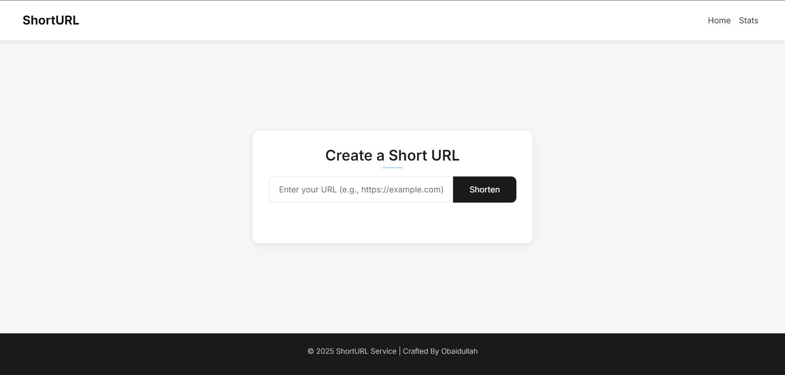
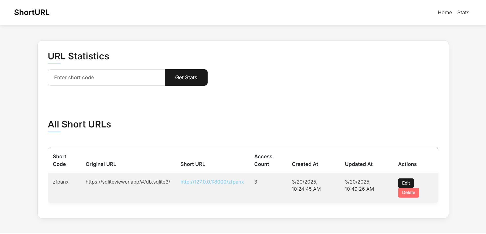

# 🔗 **Short URL Django Application**

A **URL Shortener** built with **Django**, featuring **URL creation**, **updating**, **deletion**, **redirection**, and **stat tracking**. This project uses Django's templating system and class-based views to deliver a simple and efficient short URL management system.

---

## 📌 **Key Features**

### 🌐 Create Short URLs
- Users can generate short codes that redirect to longer URLs.

### ✏️ Update & Delete
- Modify or delete existing short URLs as needed.

### 📖 View Short URL Details
- See the original URL and its corresponding shortcode.

### 📊 URL Statistics
- Track the number of times a short URL has been accessed.

### 🔁 Redirect Functionality
- Seamless redirection from a short URL to the original target.

---

## 🛠️ **Tech Stack**

- **Django** (Backend and Templating)
- **SQLite** (Default development database)
- **Bootstrap** (Frontend styling - optional)

---

## 🚀 **Getting Started**

### 1. Clone the Repository
```bash
git clone https://github.com/obaidullah72/shorturl.git
cd shorturl
```

### 2. Create & Activate a Virtual Environment
```bash
python -m venv env
source env/bin/activate   # On Windows use: env\Scripts\activate
```

### 3. Install Dependencies
```bash
pip install -r requirements.txt
```

### 4. Apply Migrations
```bash
python manage.py migrate
```

### 5. Run the Development Server
```bash
python manage.py runserver
```

### 6. Access the App
Visit `http://127.0.0.1:8000/` in your browser.

---

## 📝 **Project Structure**

```plaintext
shorturl/
├── shorturl/               # Project settings & URLs
├── shorturl_app/           # Main app: models, views, templates
│   ├── migrations/
│   ├── templates/
│   ├── models.py
│   ├── views.py
│   ├── urls.py
│   └── serializers.py
├── manage.py
└── README.md
```

---

## ⚙️ **Core Functionalities**

| Feature          | Description                           |
|------------------|---------------------------------------|
| **Create**       | Shorten long URLs and generate short codes |
| **Update**       | Modify destination URLs of short codes |
| **Delete**       | Remove short URLs if no longer needed |
| **Redirect**     | Short URL redirects to the original URL |
| **Stats**        | Track how many times a short URL is accessed |

---

## 🔒 **Admin Panel Access**
Django provides a powerful admin panel for managing the URLs.

1. Create a superuser:
```bash
python manage.py createsuperuser
```

2. Access the admin panel at:  
`http://127.0.0.1:8000/admin/`

---

## 🎨 **Screenshots**
| Home (Create URL) | Stats Page |
|-------------------|------------|
|  |  |

---

## ✅ **To-Do / Upcoming Features**
- User authentication for personal URL management
- Custom short codes on creation
- QR Code generation for short URLs
- API endpoints for external integration

---

## 🤝 **Contributing**

Contributions are welcome!  
- Fork the repo  
- Create a feature branch  
- Submit a pull request  

---

## 🛡️ **License**

This project is licensed under the [MIT License](LICENSE).

---

## 📬 **Contact**

- GitHub: [obaidullah72](https://github.com/obaidullah72)
- LinkedIn: [obaidullah72](https://www.linkedin.com/in/obaidullah72/)

---

[](https://visitcount.itsvg.in)
